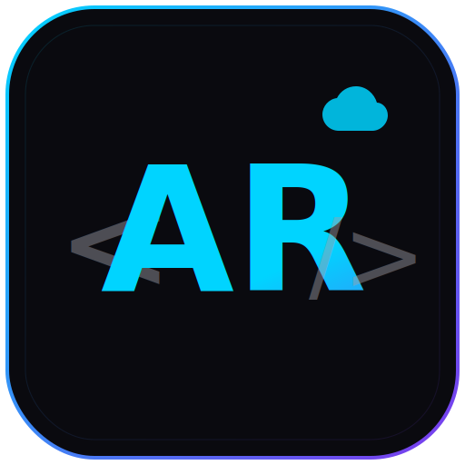

#  abhijeet-rane.github.io

My personal developer portfolio — built with vanilla HTML, CSS & JavaScript. Featuring a modern dark/light theme, GSAP animations, glassmorphism design, and structured data for ATS compatibility.

**[Live Site](https://abhijeet-rane.github.io)**

---

## Features

- **Dark / Light Theme** — Toggle with localStorage persistence and OS preference detection
- **Glassmorphism UI** — Frosted glass cards with backdrop-filter blur
- **GSAP Animations** — Hero reveal timeline, scroll-triggered reveals, timeline animations
- **Custom Cursor** — Dot + trailing ring with magnetic hover effect (desktop only)
- **Bento Grid Projects** — Mixed-size project cards with 3D tilt hover (Vanilla Tilt)
- **Animated Timeline** — Experience section with glowing dots and scroll-linked fill
- **Typing Effect** — Dynamic role text cycling in the hero section
- **Preloader** — SVG stroke animation with progress bar
- **Contact Form** — Formspree integration for real email delivery
- **Responsive** — Mobile-first design with breakpoints at 480, 768, and 1024px
- **Custom 404 Page** — Developer-themed error page with terminal aesthetic

## SEO & Machine Readability

- **JSON-LD Structured Data** — Schema.org `Person` markup for ATS/parser compatibility
- **Open Graph & Twitter Cards** — Rich link previews when shared on social media
- **Semantic HTML5** — Proper use of `<main>`, `<section>`, `<article>`, `<nav>`, `<footer>`
- **sitemap.xml & robots.txt** — For Google indexing
- **Meta Keywords** — Targeted for recruiter search terms

## Tech Stack

| Category | Technologies |
|----------|-------------|
| **Core** | HTML5, CSS3, Vanilla JavaScript (ES6+) |
| **Animations** | [GSAP 3](https://gsap.com/) + ScrollTrigger |
| **3D Effects** | [Vanilla Tilt](https://micku7zu.github.io/vanilla-tilt.js/) |
| **Icons** | [Font Awesome 6](https://fontawesome.com/) |
| **Fonts** | [Inter](https://rsms.me/inter/) + [Space Grotesk](https://fonts.google.com/specimen/Space+Grotesk) |
| **Form Backend** | [Formspree](https://formspree.io/) |
| **Hosting** | [GitHub Pages](https://pages.github.com/) |

---

Built by **Abhijeet Rane** — [LinkedIn](https://www.linkedin.com/in/abhijeet-rane-894106266) · [GitHub](https://github.com/abhijeet-rane) · [Email](mailto:abhijeetrane204@gmail.com)
